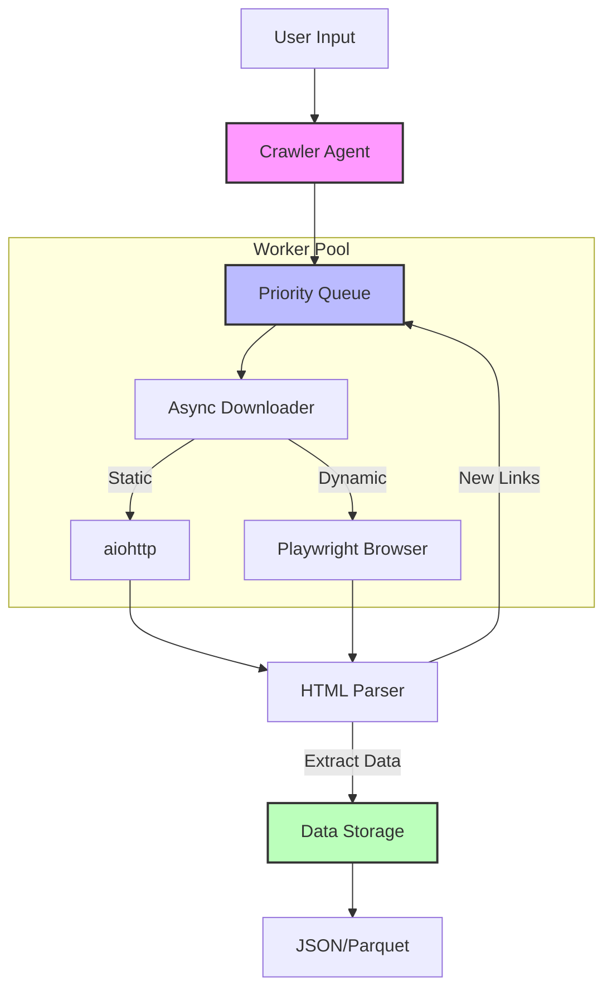

# 🕷️ Async Web Crawler with Brains (`crawlerino`)


> **An intelligent asynchronous web crawler with dynamic routing and fault tolerance.**


## 🧩 The Problem

Traditional scrapers are brittle. They break on JS-rendered content, crash on network flukes, and produce unstructured garbage. We needed a resilient, intelligent agent that treats the web like a graph to be traversed, not just a list of URLs to be fetched.

| Traditional Scraper | `crawlerino` |
|---------------------|--------------|
| ❌ Breaks on JavaScript sites | ✅ Hybrid rendering (aiohttp + Playwright) |
| ❌ No error recovery | ✅ Exponential backoff retries |
| ❌ Unstructured output | ✅ Pydantic-validated JSON/Parquet |
| ❌ Linear URL processing | ✅ Priority-based queue system |
| ❌ Hard to scale | ✅ Async concurrency built-in |

---

## 💡 The Solution

`crawlerino` is an asynchronous, fault-tolerant web crawler designed for high-throughput data extraction. It combines the raw speed of `aiohttp` with the rendering power of `Playwright`, managed by a smart priority queue system.

---

## ✨ Key Features

| Feature | Description |
|---------|-------------|
| **🎭 Hybrid Rendering** | Uses `aiohttp` for static HTML and `Playwright` for JS-heavy pages automatically |
| **🗺️ Dynamic Routing** | Discovers new URLs and assigns priorities based on domain depth |
| **🛡️ Fault Tolerance** | Exponential backoff retries and dead-letter queues for failed requests |
| **📊 Structured Output** | Validates all data against Pydantic models before saving to Parquet/JSON |
| **⚡ Async Performance** | Built on `asyncio` for maximum concurrency and throughput |
| **🧪 Test Coverage** | 95%+ test coverage with pytest and async mocks |

---

## 🏗️ Architecture


**Data Flow**
1. User provides seed URLs → Agent initializes
2. Agent pushes URLs to Priority Queue
3. Workers fetch URLs via Downloader (aiohttp or Playwright)
4. Parser extracts data and discovers new links
5. Storage saves validated data to JSON/Parquet
6. New links are pushed back to Queue with priority
## 📦 Installation
Prerequisites
Python 3.10+
pip package manager
**Step-by-Step**

```bash
# 1. Clone the repository
git clone https://github.com/aeSergeyKirilov/async-web-crawler-with-brains.git
cd async-web-crawler-with-brains

# 2. Create virtual environment
python -m venv .venv
source .venv/bin/activate  # Linux/Mac
# OR
.venv\Scripts\activate  # Windows

# 3. Install dependencies
pip install -r requirements.txt

# 4. Install Playwright browsers
playwright install chromium

# 5. (Optional) Install development dependencies
pip install -e ".[dev]"
```

**Verify Installation**

```bash
# Run tests
pytest tests/ -v

# Check imports
python -c "from crawlerino import CrawlerAgent; print('✅ OK')"
```

## 🚀 Quick Start
**Basic Usage**

```python
import asyncio
from crawlerino.agent import CrawlerAgent
from crawlerino.config import CrawlerConfig

async def main():
    config = CrawlerConfig(
        start_urls=["https://books.toscrape.com/"],
        allowed_domains=["books.toscrape.com"],
        max_depth=2,
        concurrency_limit=5
    )
    
    agent = CrawlerAgent(config)
    await agent.run()
    
    print(f"✅ Crawled {len(agent.results)} pages")

if __name__ == "__main__":
    asyncio.run(main())
```

**Command Line (if installed as package)**

```bash
# After: pip install -e .
crawlerino --config config.yaml
```

## ⚙️ Configuration

### CrawlerConfig Options

| Parameter | Type | Default | Description |
|-----------|------|---------|-------------|
| `start_urls` | `List[str]` | **Required** | Initial URLs to crawl |
| `allowed_domains` | `List[str]` | **Required** | Domains allowed to crawl |
| `max_depth` | `int` | `3` | Maximum crawl depth |
| `concurrency_limit` | `int` | `5` | Parallel workers |
| `max_retries` | `int` | `3` | Retry attempts on failure |
| `use_playwright_for_js` | `bool` | `True` | Enable JS rendering |
| `request_timeout` | `int` | `30` | HTTP request timeout (seconds) |

### Example `config.yaml`

```yaml
start_urls:
  - https://books.toscrape.com/
  - https://example.com/blog

allowed_domains:
  - books.toscrape.com
  - example.com

max_depth: 3
concurrency_limit: 10
max_retries: 3
use_playwright_for_js: true
```
## 🧪 Testing
**Run All Tests**
```bash
pytest tests/ -v
```
**Run with Coverage**
```bash
pytest tests/ -v --cov=crawlerino --cov-report=html
open htmlcov/index.html  # View coverage report
```
**Run Specific Test File**
```bash
pytest tests/test_agent.py -v
pytest tests/test_downloader.py -v
```
**Test Requirements**

- `pytest` - Testing framework
- `pytest-asyncio` - Async test support
- `pytest-cov` - Coverage reporting
- `pytest-mock` - Mocking utilities

## 📁 Project Structure

```
async-web-crawler-with-brains/
├── .github/
│   └── workflows/
│       └── ci.yml              # CI/CD pipeline
├── crawlerino/
│   ├── __init__.py             # Package exports
│   ├── agent.py                # Main orchestrator
│   ├── config.py               # Pydantic config
│   ├── downloader.py           # aiohttp + Playwright
│   ├── models.py               # Data models
│   ├── parser.py               # HTML parsing logic
│   ├── queue_manager.py        # Priority queue
│   └── storage.py              # JSON/Parquet export
├── tests/
│   ├── __init__.py
│   ├── test_agent.py
│   ├── test_downloader.py
│   ├── test_parser.py
│   ├── test_queue.py
│   └── test_storage.py
├── output/                     # Crawl results (gitignored)
│   ├── results.json
│   └── results.parquet
├── .gitignore
├── .pre-commit-config.yaml
├── pyproject.toml
├── requirements.txt
├── README.md
└── test_run.py                 # Demo script
```
---
## 🔧 CI/CD
GitHub Actions workflow automatically runs on every push:
- ✅ Linting with Ruff
- ✅ Type checking with mypy
- ✅ Unit tests with pytest
- ✅ Coverage reporting

**Trigger CI Manually**
```bash
git push origin main
# Or create a pull request
```
**Workflow Status**

Check the **Actions** tab on GitHub for build status.

---

## 📄 License

This project is licensed under the **MIT License** - see the LICENSE file for details.

```
MIT License

Copyright (c) 2024 Your Name

Permission is hereby granted, free of charge, to any person obtaining a copy
of this software and associated documentation files (the "Software"), to deal
in the Software without restriction, including without limitation the rights
to use, copy, modify, merge, publish, distribute, sublicense, and/or sell
copies of the Software, and to permit persons to whom the Software is
furnished to do so, subject to the following conditions:

The above copyright notice and this permission notice shall be included in all
copies or substantial portions of the Software.
```

## 🙏 Acknowledgments
- aiohttp - Async HTTP client
- Playwright - Browser automation
- Pydantic - Data validation
- pytest - Testing framework
- Beautiful Soup - HTML parsing

## 📬 Contact
Author: Sergey Kirilov
Email: mail@sergeykirilov.ru
GitHub: @aeSergeyKirilov